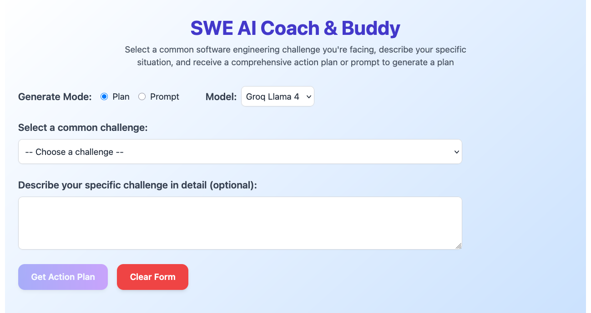

# SWE AI Coach & Buddy

### Set up
* Rename env-example to .env
* Add the necessary API keys to your .env file

### Starting frontend
cd frontend
npm install (first time only)
npm run dev

### Starting backend
cd backend/src

uvicorn main:app --reload
